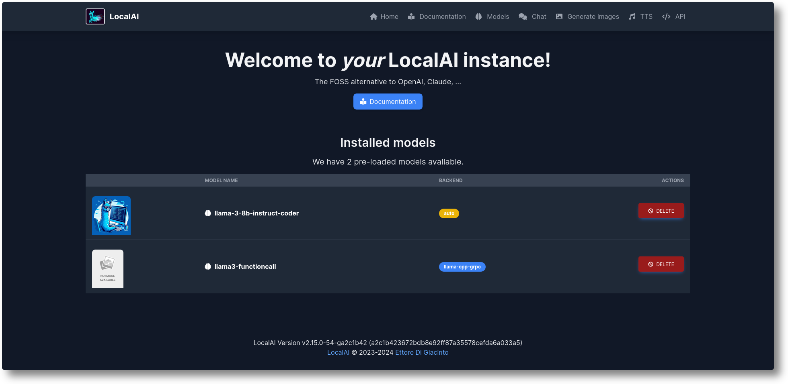

<!--
N.B.: This README was automatically generated by <https://github.com/YunoHost/apps/tree/master/tools/readme_generator>
It shall NOT be edited by hand.
-->

# LocalAI for YunoHost

[](https://ci-apps.yunohost.org/ci/apps/localai/)


[](https://install-app.yunohost.org/?app=localai)

*[Read this README in other languages.](./ALL_README.md)*

> *This package allows you to install LocalAI quickly and simply on a YunoHost server.*  
> *If you don't have YunoHost, please consult [the guide](https://yunohost.org/install) to learn how to install it.*

## Overview

LocalAI is the free, Open Source OpenAI alternative. LocalAI act as a drop-in replacement REST API that’s compatible with OpenAI (Elevenlabs, Anthropic... ) API specifications for local AI inferencing. It allows you to run LLMs, generate images, audio (and not only) locally or on-prem with consumer grade hardware, supporting multiple model families. Does not require GPU.


**Shipped version:** 2.25.0~ynh2

## Screenshots



## Documentation and resources

- Official app website: <https://localai.io/>
- Upstream app code repository: <https://github.com/mudler/LocalAI>
- YunoHost Store: <https://apps.yunohost.org/app/localai>
- Report a bug: <https://github.com/YunoHost-Apps/localai_ynh/issues>

## Developer info

Please send your pull request to the [`testing` branch](https://github.com/YunoHost-Apps/localai_ynh/tree/testing).

To try the `testing` branch, please proceed like that:

```bash
sudo yunohost app install https://github.com/YunoHost-Apps/localai_ynh/tree/testing --debug
or
sudo yunohost app upgrade localai -u https://github.com/YunoHost-Apps/localai_ynh/tree/testing --debug
```

**More info regarding app packaging:** <https://yunohost.org/packaging_apps>
